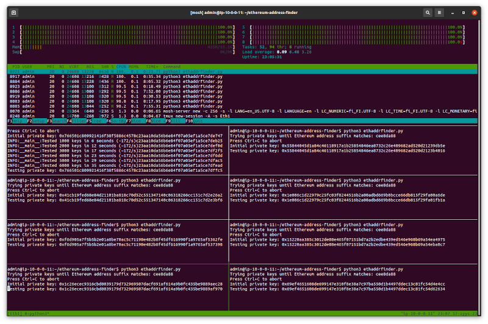

# Ethereum address finder

Small tool to find a matching private and public key for an Ethereum address
with specific suffix (for e.g. vanity Ethereum address purposes).

To understand what the program does, see the Python docstrings and source code
directly in file [ethaddrfinder.py](ethaddrfinder.py).

## Quick installation and usage

```
# Get project source code
git clone --shallow-since=1w --recurse-submodules --shallow-submodules \
  https://gitlab.com/ottok/ethereum-address-finder.git
# Enter project directory
cd ethereum-address-finder
# Replace FIND_SUFFIX with your custom value
nano ethaddrfinder.py
# Start the searh
python3 ethaddrfinder.py
# If Python complains about missing modules install them, which
# Debian and Ubuntu would happen by running e.g.
sudo apt install -y python3-pycryptodome
```

## Usage explained

Currently this the code is very crude and not user friendly.

To define your own Ethereum wallet suffix to find, update the variable
FIND_SUFFIX in the source code and run:

```
$ python3 ethaddrfinder.py
Trying private keys until Ethereum address suffix matches: a88
Press Ctrl+C to abort
Initial private key: 0xada488297c138f935ef66f50dd8edf352debde0c63606e302be8ae8df2765443
Success! Found key pair:da488297c138f935ef66f50dd8edf352debde0c63606e302be8ae8df2765e39
Private key: 0xada488297c138f935ef66f50dd8edf352debde0c63606e302be8ae8df2765e3a
Ethereum wallet address: 0x5fa2a5821a06848b52ca1f494a9375c8dbb9ca88
```

Or with debugging output enabled:
```
$ DEBUG=1 python3 ethaddrfinder.py
Trying private keys until Ethereum address suffix matches: a88
Press Ctrl+C to abort
Initial private key: 0xada488297c138f935ef66f50dd8edf352debde0c63606e302be8ae8df2765443
INFO:__main__:Tested 1000 keys in 3 seconds (~304/s)f352debde0c63606e302be8ae8df2765821
INFO:__main__:Tested 2000 keys in 6 seconds (~308/s)f352debde0c63606e302be8ae8df2765c09
Success! Found key pair:da488297c138f935ef66f50dd8edf352debde0c63606e302be8ae8df2765e39
Private key: 0xada488297c138f935ef66f50dd8edf352debde0c63606e302be8ae8df2765e3a
Ethereum wallet address: 0x5fa2a5821a06848b52ca1f494a9375c8dbb9ca88
INFO:__main__:Program ran for 8 seconds generating 2551 keys (~309/s).
```

## Performance considerations

The code is *not optimized* and it runs only on one single code, so don't
expect wonders in terms of performance.

If you have a beefy machine, you can start multiple processes in for example
using [tmux](https://tmuxcheatsheet.com/) and monitor with
[htop](https://htop.dev/) that you have all CPUs running at full utilization.

The code has not been benchmarked if runs faster on standard
[CPython](https://en.wikipedia.org/wiki/CPython) or
[PyPy](https://en.wikipedia.org/wiki/PyPy) as PyPy fails to start due to missing
library `_keccak.pypy36-pp73-x86_64-linux-gnu.so`.

In a quick benchmark the program did *not* run visibly faster when compiled with
[Cython](https://cython.org/), perhaps due to lack of Cython specific
optimizations in the code.




## Contributing

Pull requests are welcome. For major changes, please open an issue first
to discuss what you would like to change.

Please make sure to update tests as appropriate.

## License

[GPLv3](https://choosealicense.com/licenses/gpl-3.0/)

## Project status

This was written just for fun. There are no guarantees that the code is correct
or that it runs in your particular environment.
